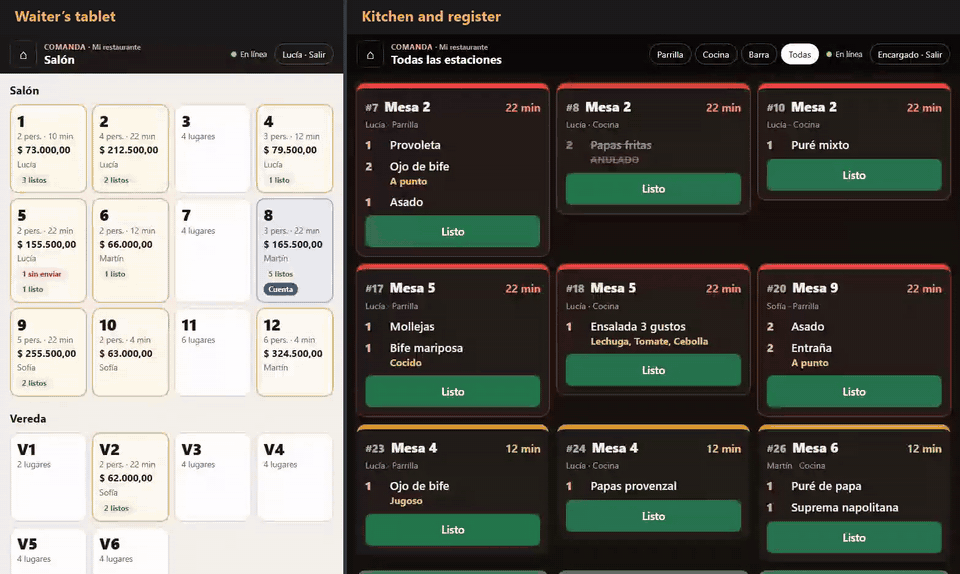
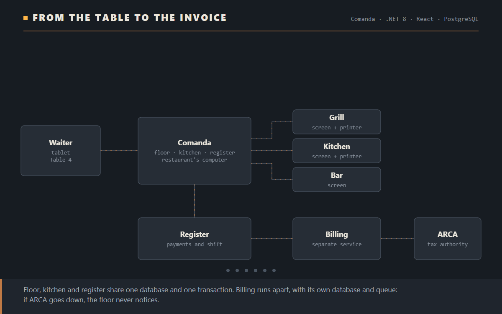
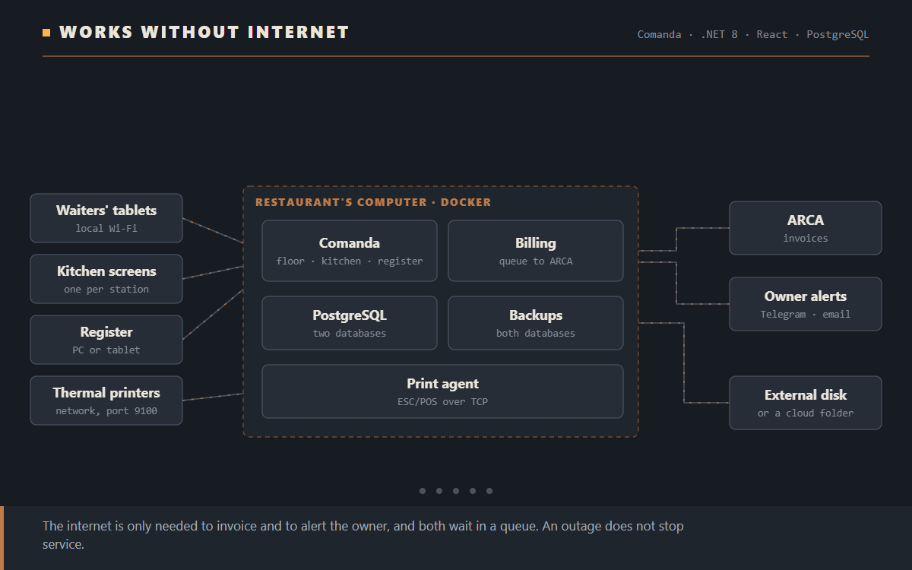
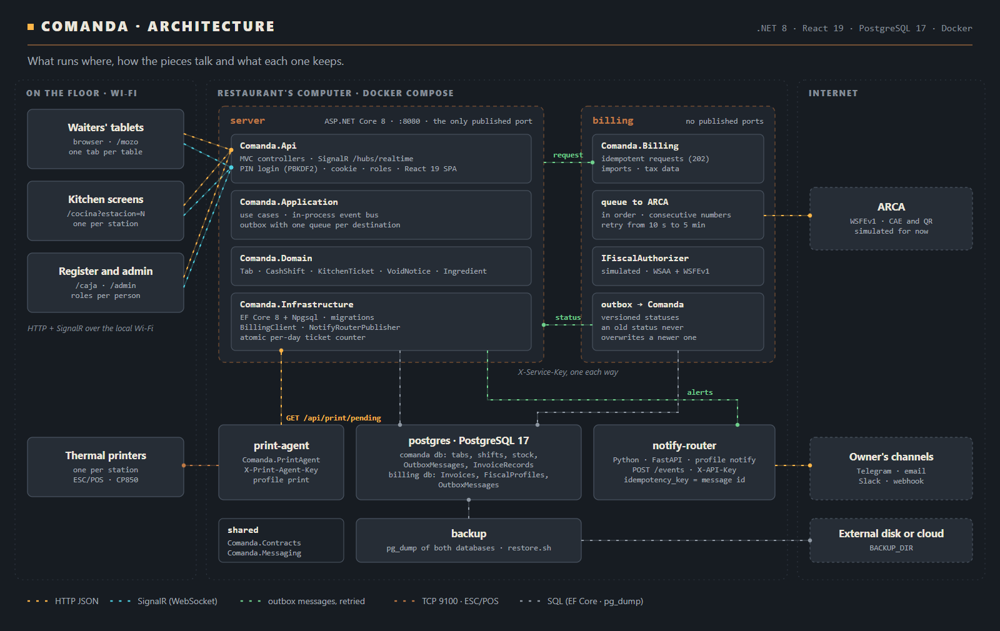

# Comanda

**Restaurant management.** Waiters take orders on a tablet, every kitchen station gets its own items on screen and on paper, the register takes payment and invoices, and the owner hears about what matters without being there. It all runs on a computer at the restaurant, so **if the internet goes down, the floor keeps working**.

**[Versión en español](README.md)** · **[Case study with the animated diagrams](https://federicomoroz.github.io/en/projects/comanda/)**

> The code is private. This repository holds the public documentation: what it does, how it works inside and why it is built this way.
>
> The starting menu comes from the public online menu of a real grill. Everything else (drinks, tables, staff, ingredients, costs and tax data) is simulated, and invoicing runs against a simulated ARCA, the Argentine tax authority: invoices print as "not valid for tax purposes". The app itself is in Spanish.



[Watch the full video (46 s)](docs/media/app_en.mp4): the waiter's tablet on the left, the kitchen and then the register on the right. Recorded with the application running, in one take.

## What it does

| | |
|---|---|
| **Waiters** | See the floor with each table's state, open tabs, take orders with their options (doneness, sides, flavour) and send them to the kitchen. They see the moment something is ready. |
| **Kitchen** | One screen per station (grill, kitchen, bar) with the day's numbered tickets. Each one turns amber and then red as it runs late. If the station has a printer the ticket also comes out on paper, and voiding something that is being prepared prints a void notice. |
| **Register** | Split payments across payment methods, with tips and change. Issues invoices A, B or C with CAE and QR without making anyone wait, lists what was charged but not invoiced yet, and closes the shift with a cash count. |
| **Admin** | Everything about the business changes on screen, not in code: menu, prices, options, stations, tables, staff and permissions, payment methods, tax data and alert thresholds. |
| **Stock and margins** | Every dish has its recipe. Charging a tab deducts the ingredients, and the admin shows each dish's margin and which ones fell below target. |
| **Owner alerts** | By Telegram, email, Slack or webhook: an ingredient reaching its minimum, a shift closing short, a large void, ARCA not answering and when it is back. |

<table>
<tr>
<td width="50%"></td>
<td width="50%"></td>
</tr>
<tr>
<td><b>Floor.</b> Each table shows its total, who serves it and whether it has dishes ready or the bill requested.</td>
<td><b>Kitchen.</b> The colour says how late each ticket is running; voided items stay crossed out.</td>
</tr>
<tr>
<td></td>
<td></td>
</tr>
<tr>
<td><b>Register.</b> Invoice B with CAE and ARCA's QR, simulated in this version.</td>
<td><b>Margins.</b> With each recipe's cost, every dish shows what it earns.</td>
</tr>
</table>

## How it works



Floor, kitchen and register share one database and one transaction: charging a tab deducts stock, closes the table and adds to the shift, and either all of it happens or none of it does. Invoicing runs apart, in its own service with its own database, because it depends on ARCA, which does not always answer.

## If something goes down, nothing is lost


- **If billing is down**, the register shows "waiting for billing" and the reason. The request stays saved and goes out on its own when billing is back. With the production images, it went out 14 seconds after the service came back.
- **If ARCA does not answer**, the invoice waits in a queue that retries further apart each time, in order, so numbering stays consecutive.
- **If something is sent twice**, nothing is duplicated: every request carries an id and every status a version number.

## Works without internet



The internet is only needed to invoice and to alert the owner, and both wait in a queue. Both databases back themselves up once a day to an external disk or a cloud-synced folder, and restoring takes one command.

---

## For engineers

### The whole map

[](https://federicomoroz.github.io/diagramas/comanda/arquitectura_en.html)

The interactive version, with connections animated by kind, is [on the site](https://federicomoroz.github.io/diagramas/comanda/arquitectura_en.html).

### Stack

| | |
|---|---|
| Backend | C# · .NET 8 · ASP.NET Core MVC · SignalR · EF Core 8 + Npgsql |
| Frontend | React 19 · TypeScript 5.9 · Vite, served by the same server |
| Data | PostgreSQL 17, one database per service |
| Integrations | notify-router (Python · FastAPI), ESC/POS printers over TCP 9100, ARCA (WSFEv1, simulated) |
| Deployment | Docker Compose on a computer at the restaurant |
| Tests | xUnit · Testcontainers · WebApplicationFactory |

### What runs and why it is split

| Service | Why it runs apart |
|---|---|
| **server** (`Comanda.Api`) | Floor, register, kitchen and stock. They stay together because an operation like charging a tab touches all of them and has to land whole or not at all, in one transaction. |
| **billing** (`Comanda.Billing`) | Depends on ARCA, which goes down, and with real ARCA holds the restaurant's certificate. Own database, queue and outbox. Publishes no ports. |
| **print-agent** | Has to run near the printers. Asks over HTTP what to print and sends it as ESC/POS. |
| **notify-router** | Another language and release cycle. If it goes down, the floor never notices. |
| **backup** | `pg_dump` of both databases, with retention and restore. |

The decision to move invoicing into its own service, the alternatives that were dropped and how the move was made are in [ADR 0001](docs/adr/0001-facturacion-como-servicio-aparte.md) (in Spanish).

### Design decisions

- **Transactional outbox both ways.** What one service owes the other is saved in the same transaction as the change that caused it and sent afterwards, with retries. Comanda keeps one queue per destination: notify-router being down does not hold back invoice requests. A new request never jumps ahead of an older message for the same destination.
- **The cashier hears back at once.** The invoice request is saved and also sent right away. A 422 from billing (a mistyped ID number, say) reaches the cashier with its reason; if billing does not answer, the request waits in the queue.
- **At least once delivery, exactly once effect.** Requests are idempotent by id and statuses carry a version: an old one arriving late is ignored. 2xx is delivered; 5xx, 408 and 429 are retried; any other 4xx is parked with the error shown to the admin.
- **The database draws the lines.** Partial unique indexes prevent two open tabs on one table, two open shifts, two live invoices for one tab and two tickets with the same number. Ticket numbers come from an atomic per-day counter (`INSERT … ON CONFLICT … RETURNING`). Tabs, shifts and invoices carry a concurrency token.
- **Copies, not references.** Each item keeps the name, price, VAT and station it had when it was ordered: editing the menu never changes open tabs or history.
- **Stock as a ledger.** Purchases, counts, waste and sales; nothing is overwritten.
- **Sessions checked on every request.** PIN login (PBKDF2) with lockout, a session cookie and roles. Deactivating someone or changing their role cuts their access at once.
- **Data moves without gaps.** Invoices Comanda issued before billing had its own service moved over with a migration that, in one transaction, turns every row into an outbox message and drops the old tables. Billing imports them with their original number and CAE.

### Tests

173 tests: 146 for Comanda and 27 for billing. Integration tests run against real PostgreSQL with Testcontainers, and Comanda's also start the billing service in memory, with its own database, talking over HTTP. Among other things they check:

- that two cashiers charging the same balance at once charge it once, and that five waiters sending at once get different ticket numbers;
- that only an admin changes settings, and that a stock import failing halfway saves nothing;
- that the agent prints over TCP to a simulated printer, retries when it is off and prints the void notice after the ticket;
- that invoices wait while ARCA or billing is down and go out on their own when they are back, and that notify-router being down does not hold back invoice requests;
- that the migration that moved invoices to billing works on a database with data.

The whole system was also tested end to end with the production images: billing down, ARCA down, the server down while billing authorizes, the server starting without billing, a full restart and a backup restore.

### Installing at the restaurant

```bash
cd deploy
copy .env.example .env        # password, two service keys and the backup folder
docker compose up -d --build  # served at http://<computer's IP>
```

It starts PostgreSQL, the server, billing and the backup service. The print agent and notify-router are optional profiles (`--profile print`, `--profile notify`).
