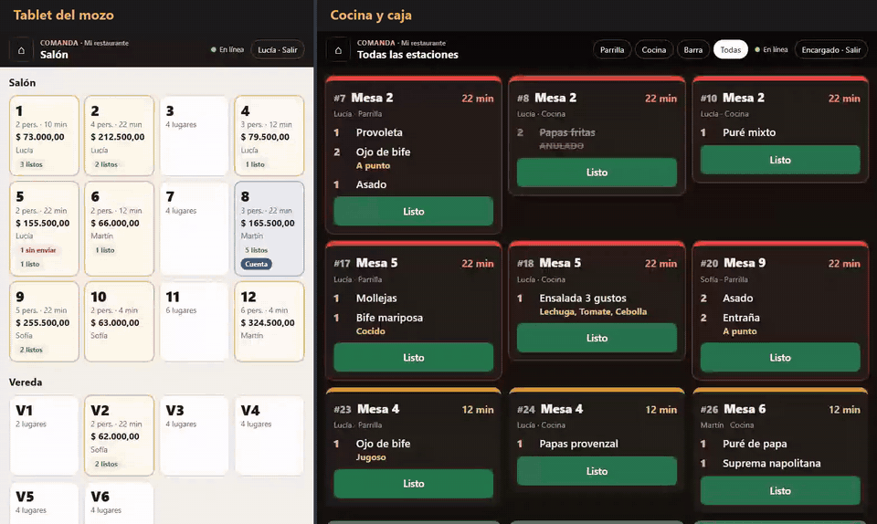
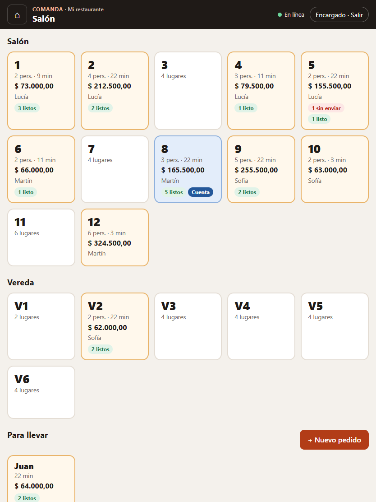
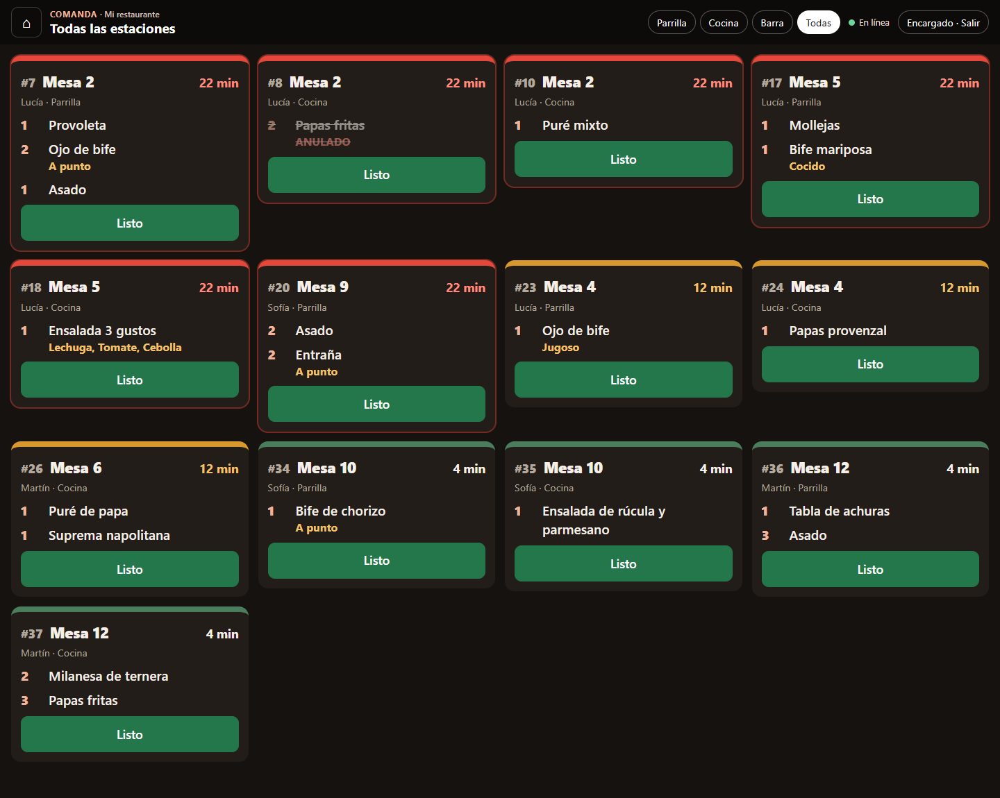
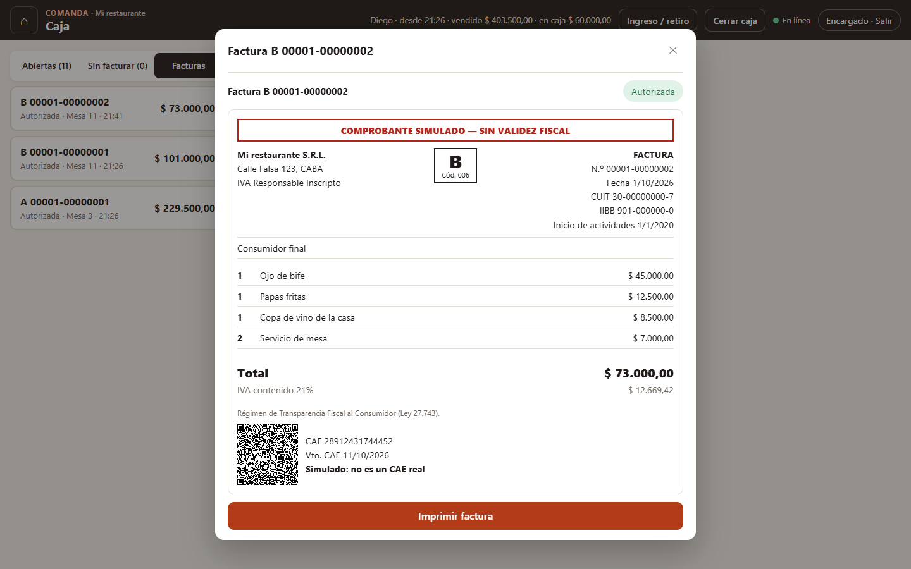
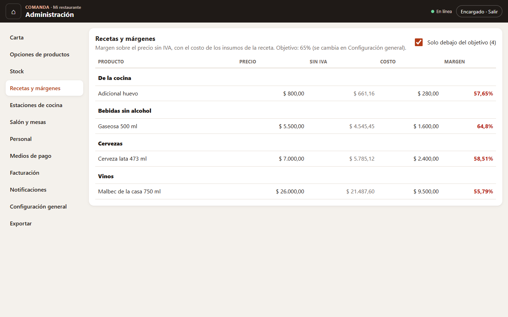
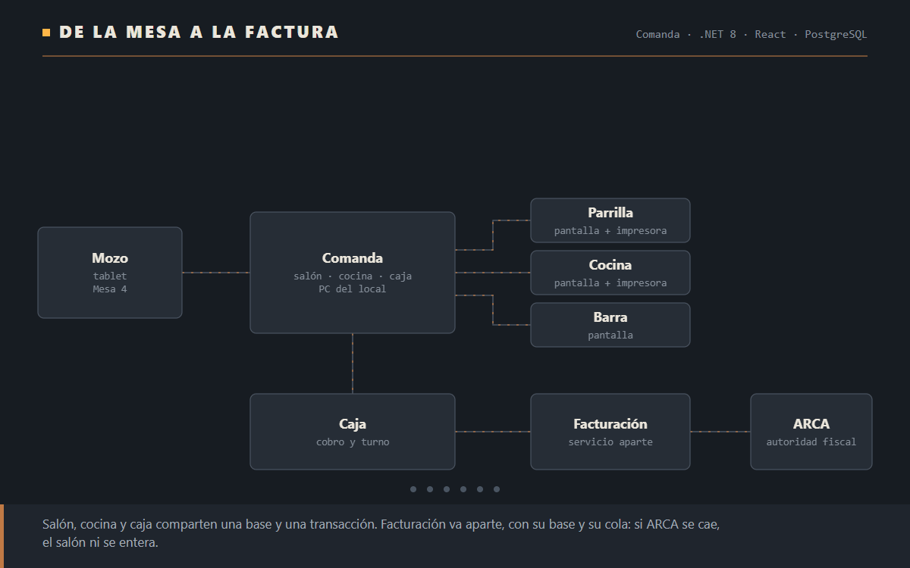
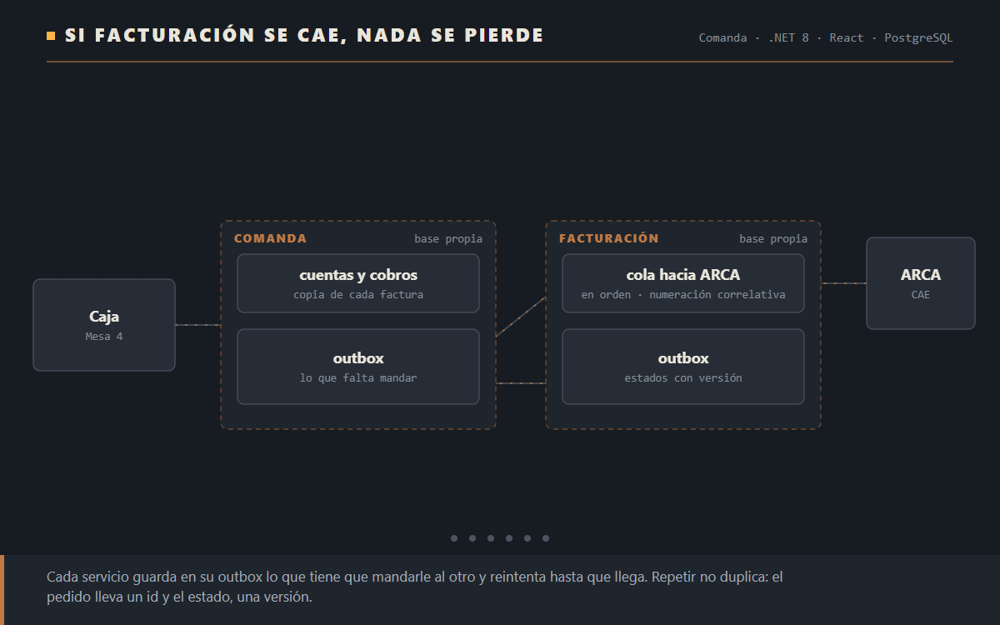
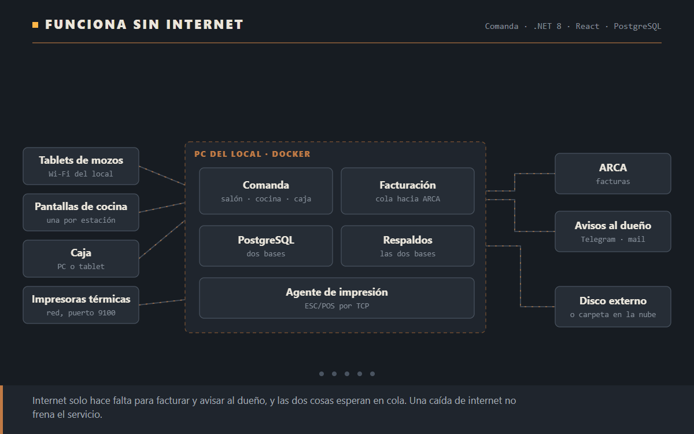

# Comanda

**Gestión gastronómica para un restaurante.** Los mozos toman los pedidos en una tablet, cada estación de la cocina recibe lo suyo en pantalla y en papel, la caja cobra y factura, y el dueño se entera de lo importante sin estar en el local. Todo corre en una computadora del restaurante, así que **si se corta internet el salón sigue funcionando**.

**[English version](README.en.md)** · **[Case study con los diagramas animados](https://federicomoroz.github.io/es/projects/comanda/)**

> El código es privado. Este repositorio tiene la documentación pública: qué hace, cómo funciona por dentro y por qué está hecho así.
>
> Las mesas, el personal, los insumos, los costos y los datos fiscales que se ven son de prueba, y la facturación usa un ARCA simulado: los comprobantes salen como «sin validez fiscal».



[Ver el video completo (46 s)](docs/media/app.mp4): a la izquierda la tablet del mozo, a la derecha la cocina y después la caja. Grabado con la aplicación funcionando, sin cortes.

## Qué hace

| | |
|---|---|
| **Mozos** | Ven el salón con el estado de cada mesa, abren cuentas, cargan pedidos con sus opciones (punto de la carne, guarnición, sabor) y los envían a cocina. Se enteran en el momento cuando algo está listo. |
| **Cocina** | Una pantalla por estación (parrilla, cocina, barra) con las comandas numeradas del día. Cada una se pone amarilla y después roja a medida que se demora. Si la estación tiene impresora, la comanda también sale en papel, y si se anula algo que se está preparando, sale un aviso de anulación. |
| **Caja** | Cobra en partes con distintos medios de pago, con propina y vuelto. Emite factura A, B o C con CAE y QR sin hacer esperar a nadie, lista lo cobrado que falta facturar y cierra el turno con arqueo. |
| **Administración** | Todo lo del negocio se cambia desde la pantalla, no desde el código: carta, precios, opciones, estaciones, mesas, personal y permisos, medios de pago, datos fiscales y umbrales de avisos. |
| **Stock y márgenes** | Cada plato tiene su receta. Al cobrar se descuentan los insumos, y la administración muestra el margen de cada plato y cuáles quedaron por debajo del objetivo. |
| **Avisos al dueño** | Por Telegram, mail, Slack o webhook: un insumo que llega al mínimo, una caja que cierra con diferencia, una anulación grande, ARCA que no responde y cuando vuelve. |

<table>
<tr>
<td width="50%"></td>
<td width="50%"></td>
</tr>
<tr>
<td><b>Salón.</b> Cada mesa muestra cuánto lleva, quién la atiende y si tiene platos listos o la cuenta pedida.</td>
<td><b>Cocina.</b> El color dice cuánto se está demorando cada comanda; lo anulado queda tachado.</td>
</tr>
<tr>
<td></td>
<td></td>
</tr>
<tr>
<td><b>Caja.</b> Factura B con CAE y el QR de ARCA, simulado en esta versión.</td>
<td><b>Márgenes.</b> Con el costo de la receta, cada plato muestra cuánto deja.</td>
</tr>
</table>

## Cómo funciona



Salón, cocina y caja comparten una base de datos y una transacción: cobrar una cuenta descuenta stock, cierra la mesa y suma al turno, y o pasa todo o no pasa nada. La facturación va aparte, en su propio servicio con su propia base, porque depende de ARCA, que a veces no responde.

## Si algo se cae, no se pierde nada



- **Si Facturación está caída**, la caja muestra «Esperando a Facturación» y el motivo. El pedido queda guardado y sale solo cuando vuelve. Con las imágenes de producción, salió 14 segundos después de levantar el servicio.
- **Si ARCA no responde**, la factura espera en una cola que la reintenta cada vez más espaciado, en orden, para que la numeración siga correlativa.
- **Si se repite un envío**, no se duplica nada: cada pedido lleva un identificador y cada estado, un número de versión.

## Funciona sin internet



Internet solo hace falta para facturar y para avisarle al dueño, y las dos cosas esperan en cola. Las dos bases de datos se respaldan solas una vez por día en un disco externo o en una carpeta que sincroniza la nube, y se restauran con un comando.

---

## Para técnicos

### El mapa completo

[](https://federicomoroz.github.io/diagramas/comanda/arquitectura.html)

La versión interactiva, con las conexiones animadas por tipo, está en [el sitio](https://federicomoroz.github.io/diagramas/comanda/arquitectura.html).

### Servicios propios que usa

| Servicio | Para qué | Links |
|---|---|---|
| **notify-router** | Los avisos al dueño. Comanda guarda cada aviso en su outbox y se lo manda; notify-router decide a quién y por qué canal (Telegram, mail, Slack o webhook). Cada aviso viaja con una clave de idempotencia. | [Repo](https://github.com/federicomoroz/notify-router) · [Página](https://federicomoroz.github.io/es/tools/#notify-router) |
| **webhook-logger** | Canal de destino en las pruebas de punta a punta de los avisos: con cada eslabón cortado a propósito, cada aviso llegó una sola vez. | [Repo](https://github.com/federicomoroz/webhook-logger) · [Demo](https://webhook-logger-9paz.onrender.com) · [Página](https://federicomoroz.github.io/es/tools/#webhook-logger) |

### Stack

| | |
|---|---|
| Backend | C# · .NET 8 · ASP.NET Core MVC · SignalR · EF Core 8 + Npgsql |
| Frontend | React 19 · TypeScript 5.9 · Vite, servido por el mismo servidor |
| Datos | PostgreSQL 17, una base por servicio |
| Integraciones | notify-router (Python · FastAPI), impresoras ESC/POS por TCP 9100, ARCA (WSFEv1, simulado) |
| Despliegue | Docker Compose en una PC del local |
| Tests | xUnit · Testcontainers · WebApplicationFactory |

### Qué corre y por qué está separado

| Servicio | Por qué va aparte |
|---|---|
| **server** (`Comanda.Api`) | Salón, caja, cocina y stock. Van juntos porque una operación como cobrar toca a todos y tiene que quedar completa o no quedar, en una sola transacción. |
| **billing** (`Comanda.Billing`) | Depende de ARCA, que se cae, y con ARCA real tiene el certificado del local. Tiene su base, su cola y su outbox. No publica puertos. |
| **print-agent** | Tiene que correr cerca de las impresoras. Pregunta por HTTP qué imprimir y lo manda en ESC/POS. |
| **notify-router** | Otro lenguaje y otro ciclo de vida. Si se cae, el salón no se entera. |
| **backup** | `pg_dump` de las dos bases, con retención y restauración. |

La decisión de sacar la facturación a un servicio propio, las alternativas que se descartaron y cómo se hizo la mudanza están en el [ADR 0001](docs/adr/0001-facturacion-como-servicio-aparte.md).

### Decisiones de diseño

- **Outbox transaccional en los dos sentidos.** Lo que un servicio le debe al otro se guarda en la misma transacción que el cambio que lo causó y sale después, con reintentos. Comanda tiene una fila por destino: notify-router caído no frena los pedidos de factura. Un pedido nuevo nunca se adelanta a un mensaje más viejo para el mismo destino.
- **El cajero se entera en el momento.** El pedido de factura se guarda y además se intenta mandar enseguida. Un 422 de Facturación (un DNI mal cargado, por ejemplo) le llega al cajero con el motivo; si Facturación no responde, el pedido queda en cola.
- **Entrega al menos una vez, efecto una sola vez.** Los pedidos son idempotentes por id y los estados llevan versión: uno viejo que llega tarde se ignora. 2xx entregado; 5xx, 408 y 429 se reintentan; cualquier otro 4xx queda apartado con el error a la vista del administrador.
- **La base pone los límites.** Índices únicos parciales impiden dos cuentas abiertas en la misma mesa, dos cajas abiertas, dos facturas vivas para una cuenta y dos comandas con el mismo número. El número de comanda sale de un contador atómico por día (`INSERT … ON CONFLICT … RETURNING`). Cuentas, turnos y facturas tienen token de concurrencia.
- **Copias, no referencias.** Cada ítem guarda el nombre, el precio, el IVA y la estación del momento en que se pidió: cambiar la carta no altera las cuentas abiertas ni la historia.
- **Stock como libro de movimientos.** Compras, conteos, mermas y ventas; nada se pisa.
- **Sesiones validadas en cada pedido.** Login por PIN (PBKDF2) con bloqueo por intentos, cookie de sesión y roles. Desactivar a alguien o cambiarle el rol corta su acceso al instante.
- **Las mudanzas de datos no dejan ventanas.** Las facturas que Comanda emitía antes de tener un servicio aparte pasaron a Facturación con una migración que, en una sola transacción, convierte cada fila en un mensaje del outbox y borra las tablas viejas. Facturación las importa con su número y su CAE originales.

### Tests

173 tests: 146 de Comanda y 27 de Facturación. Los de integración corren contra PostgreSQL real con Testcontainers, y los de Comanda levantan también el servicio de Facturación en memoria, con su propia base, hablándose por HTTP. Entre otras cosas verifican:

- que dos cajeros cobrando el mismo saldo a la vez lo cobren una sola vez, y que cinco mozos enviando a la vez reciban números de comanda distintos;
- que solo un administrador cambie la configuración, y que una carga de stock que falla a mitad no deje nada guardado;
- que el agente imprima por TCP contra una impresora simulada, reintente si está apagada y saque el aviso de anulación después de la comanda;
- que las facturas esperen mientras ARCA o Facturación están caídas y salgan solas cuando vuelven, y que notify-router caído no frene los pedidos de factura;
- que la migración que mudó las facturas a Facturación funcione sobre una base con datos.

Además, el sistema completo se probó de punta a punta con las imágenes de producción: Facturación caída, ARCA caída, el servidor caído mientras Facturación autoriza, el servidor arrancando sin Facturación, un reinicio completo y una restauración de respaldo.

### Instalación en el local

```bash
cd deploy
copy .env.example .env        # contraseña, dos claves de servicio y carpeta de respaldos
docker compose up -d --build  # queda en http://<IP de la PC>
```

Levanta PostgreSQL, el servidor, Facturación y el servicio de respaldos. El agente de impresión y notify-router son perfiles opcionales (`--profile print`, `--profile notify`).
